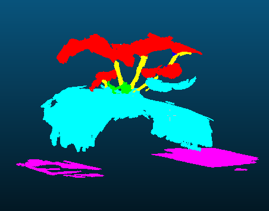
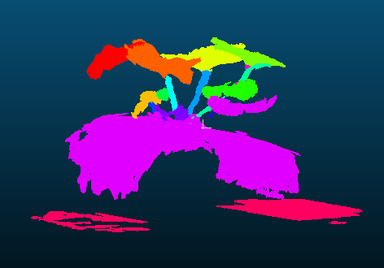

# 3D-point-clouds-plant-phenotyping
Automated segmentation and annotation of 3D point clouds for plant phenotyping


## File Structure
```
.
├── colored_annotation_processor.py   # Code for visualizing class and instance annotations                         
├── sample_output                     # Sample visualisation of class and instance annotation for ”A2_20220512_a.xyz“
└── README.md                         # This README file
```

## Data

The dataset used is LAST-Straw, which can be found at [LAST-Straw Dataset](https://lcas.lincoln.ac.uk/nextcloud/index.php/s/omQY9ciP3Wr43GH).


## Running the file

Download the LAST-Straw dataset and place it under the `./data` directory.

Make sure to install necessary libraries:

```sh
pip install numpy open3d colour-science
```

Then run

```sh
python colored_annotation_processor.py
```


## Example

Example of an original `.xyz` file:  ”A2_20220512_a.xyz“


Class Annotation



Instance Annotation




